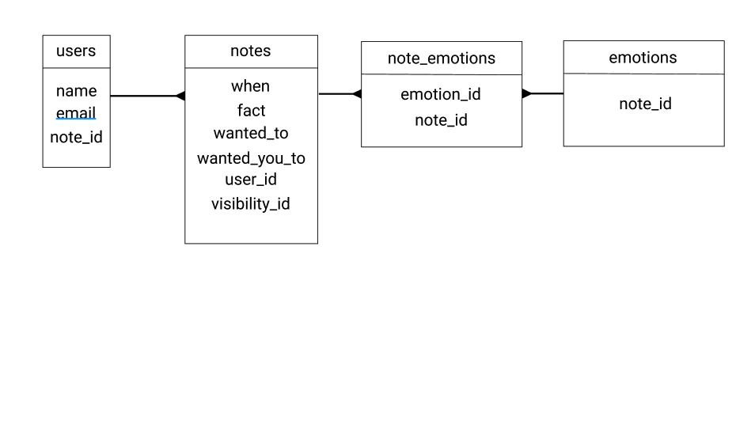
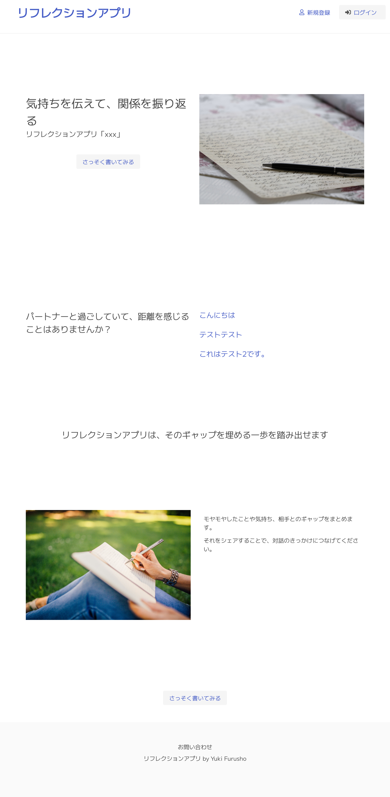
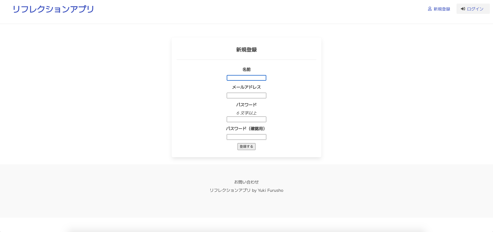
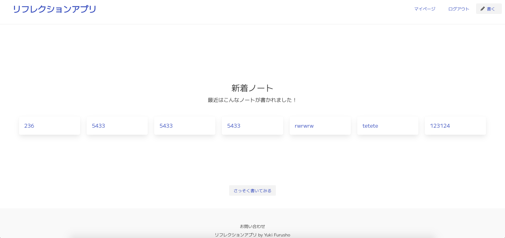
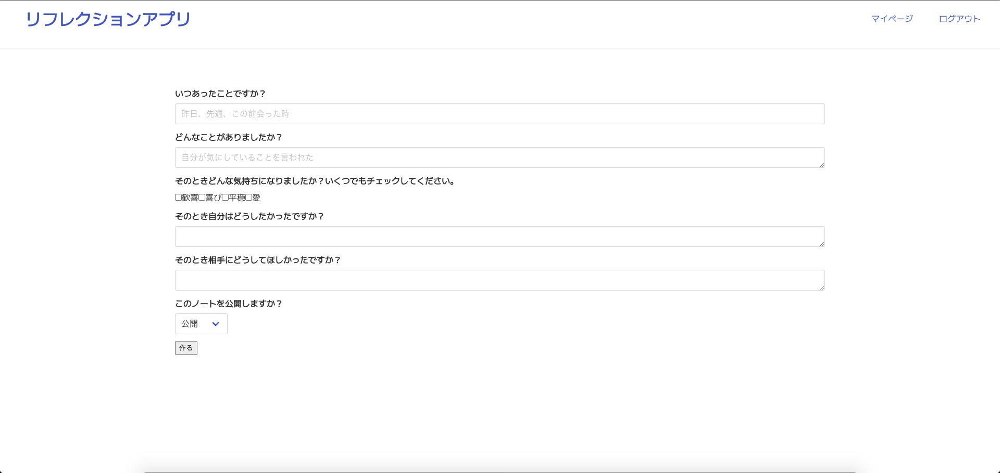
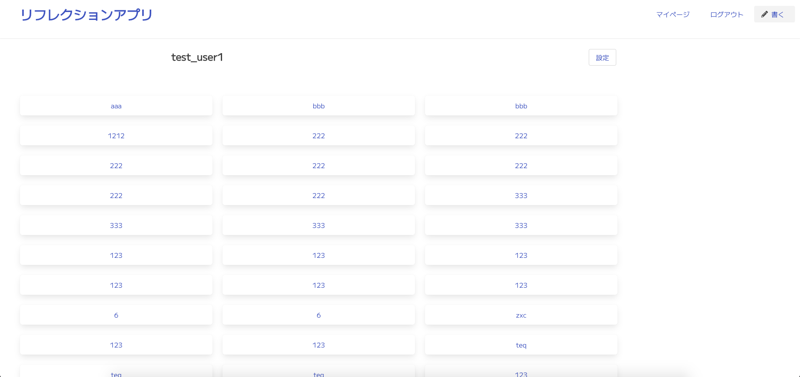

# リフレクションアプリ（仮）
## 概要
- 目的：主にパートナー間の不仲を解消する支援
  - 利用方法：いくつかの質問に答え、シェアする

## 今後の実装予定
- SNS(LINE)での共有機能
- SNSを利用したログイン機能
- ウィザード形式での入力

## ER図

## イメージ

## その他
- 企画概要とそのプロセス、要件定義、テーブル設計、カンバンなどの進捗はnotionで一元管理しています。
  - https://inky-boat-ebc.notion.site/c2078fbac3d4472b9a282bc0ee082880
- 画面遷移図やデザインはfigmaにまとめています。
  - https://www.figma.com/file/mwn1sOj7puEV0Bd51UcNiE/%E9%96%A2%E4%BF%82%E3%82%92%E6%8C%AF%E3%82%8A%E8%BF%94%E3%82%8B?node-id=0%3A1